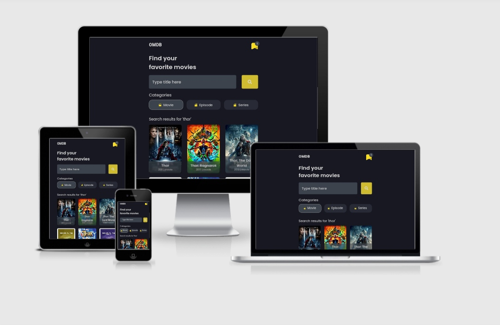

<h3 align="center">OMDB APP</h3>

Find your favorite movies

### About
Open Movie DataBase is a website-based application that applies the Single Page Application concept and is built using the Vue JS framework

with this application the user can search for information from a film based on the keywords and categories the user wants. 
Users can save their favorite movies into a bookmark list so they can be viewed again quickly

### Languages and Tools
- Vue Js
- Vue router
- Axios
- SASS Preprocessor
- OMDB API
- Google Font
- FontAwesome
- Termux
- Vite Js
- Acode code editor

### Responsive Test
Test via [Am I Responsive](http://ami.responsivedesign.is/)

### Install Vite JS
- <code>npm init vite@latest</code>
- [See documentation](https://vitejs.dev/guide/)

### Clone This Repo
- <code>git clone https://github.com/or-abdillh/omdb-app.git </code>
- <code>cd omdb-app</code>
- <code>npm install</code>
- <code>npm run dev</code>
- if you get an <b>error on esbuild</b> try to install manual, run this code before <code>npm run dev</code> : 
- <code>node node_modules/esbuild/install.js</code> to install manually

### Demo 
- [OMDB APP](https://omdb-app-hazel.vercel.app/)

[Oka R Abdillah ](http://github.com/or-abdillh)
 
Last edited on : 01/9/2021
